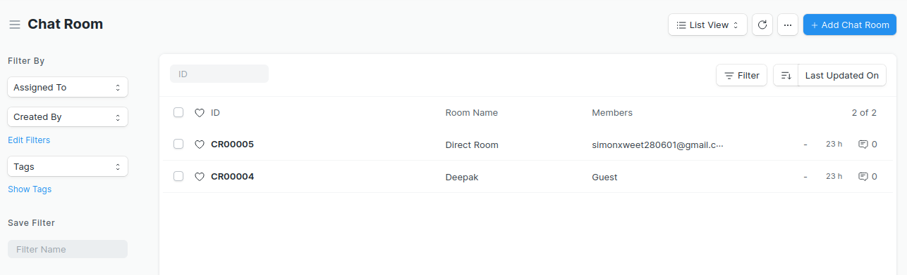
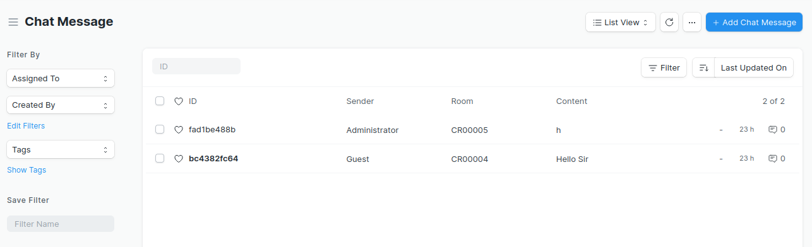
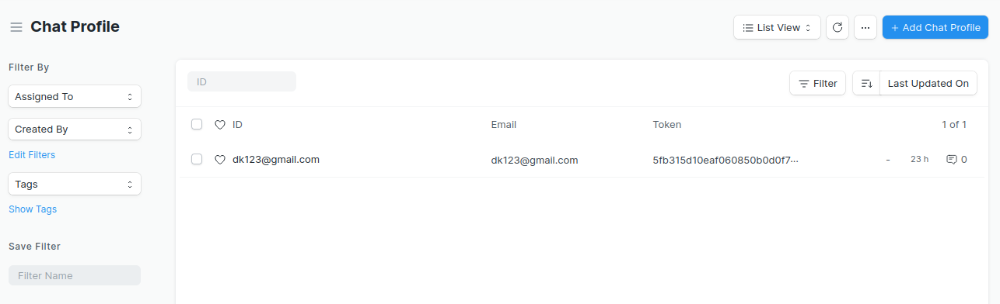
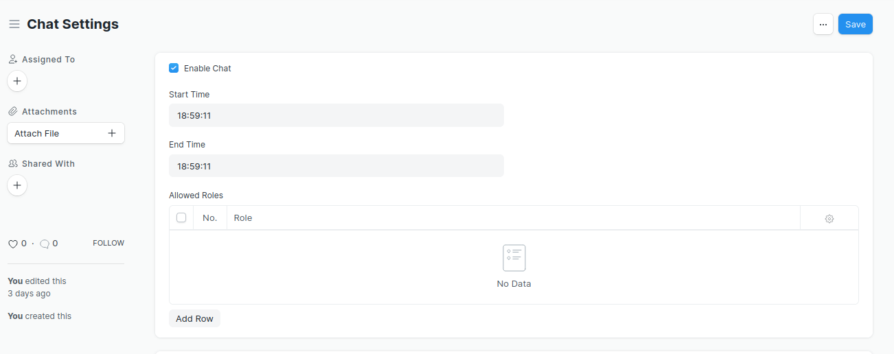
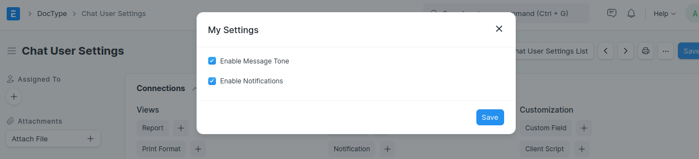
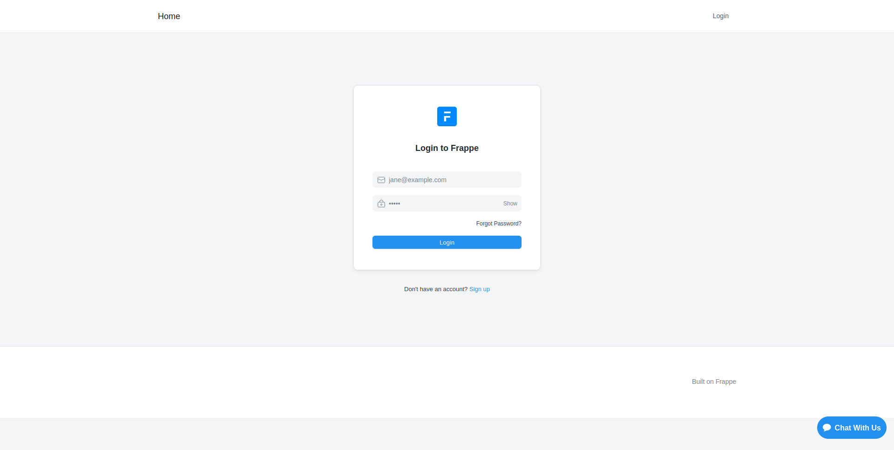
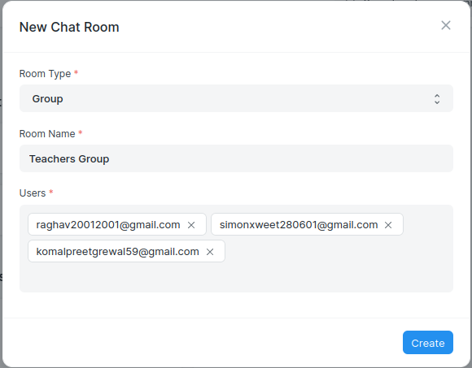

## Report-File-On-Chat

### Chat 
It is the commmuncation software where people interact with others through the text messages.Chat is a tool, which allows you to send and receive messages to other Users within your ERPNext account.This tool can be used to maintain internal communications within your organization.

### To install
By following below commands -

$ bench get -app chat

$ bench --site sitename install -app chat

### Doctypes
In which having 5 doctypes -

 1. Chat room
 
 
 2. Chat message
 
 
 3. Chat profile
 
 
 4. Chat setting
 
 
 5. Chat user setting
 
 
 #### 1 Chat room -
 It is the space where user inetract with others (Admin , System user) by the text messages.Chat room can be created by the 3 ways :
 1. By guest- Guests will see only one small button on the below right side on the web page. Guests will click on it , enter some basic information (  Name,Email-id,message) and submit.Guest does not have any setting option on chat but if it visits again on the same site then it will see the last conversation where it left.
 

 2. By Direct- In which Users have a right to create its own chat room by adding only room type and user id. Direct communication is held.
 

 3. By group- It is similar to the direct but admin can add multiple users in chat.
 

#### 2. Chat message -
It is the space where text are sent between people. Every message that has been sent by a User gets reflected in the Chat Message List.

#### 3. Chat profile -
Chat profile show you a list of all the active profiles in your ERPNext account with whom you can start a chat.To start a new chat, simply type the name of the User in the search bar of chatbox and start communicating.

#### 4. Chat setting -
In chat setting can set the timing to enable the chat.
- Admin assign the roles to the user.

#### 5 . Chat user setting -
This setting shows at the user end where user can enable the notificaton tone and message tone etc.

#### Question Asked

Q1. why we select the users in chat room one by one?

Q2. What is token?

Q3. How the feature of version14 chat app is useful for us?

Q4. Is video can be send?

Q5. why file cannot be send greater then 5MB size?

Q6. Can user customized their messages after sent once as in whatsapp we can delete the message at both send even after delivered?
